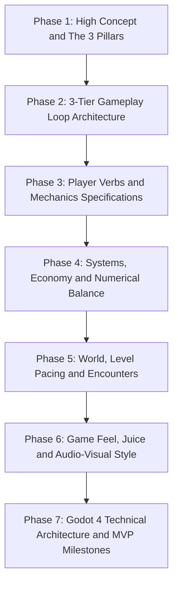
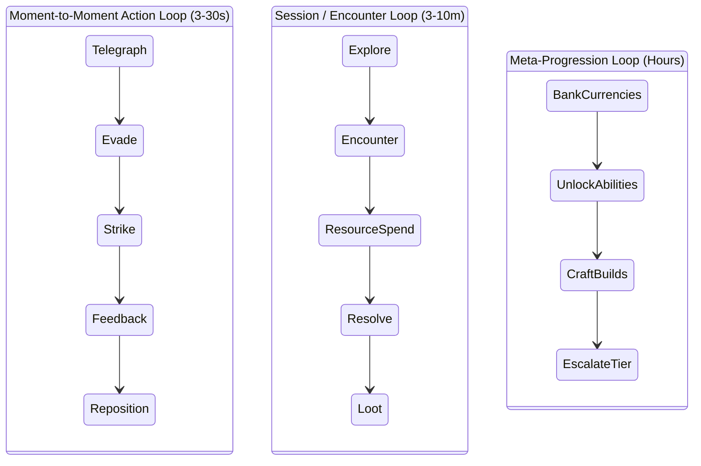

# Game Design Document (GDD) Authoring Procedure

This skill provides a consultative, seven-phase methodology for designing and documenting production-ready video games. It structures game design concepts into technical, actionable specifications that translate directly into Godot 4 architecture.

## Design Philosophy

A successful Game Design Document serves three primary audiences:

1. **Engineers**: Provides exact mechanics parameters, state machine definitions, input mappings, and mathematical formulas.
2. **Artists and Audio Designers**: Establishes art direction guidelines, visual effect feedback rules, and dynamic audio stem behaviors.
3. **Level and Content Designers**: Defines pacing rhythms, encounter difficulty curves, and spatial blocking requirements.

---

## 7-Phase Creation Methodology



---

## Phase 1: High Concept and Design Pillars

### 1.1 The Hook and Elevator Pitch

- **Premise Statement**: A single sentence articulating the core fantasy and mechanical hook (for example: *A fast-paced top-down roguelite where time only advances when the player moves or fires*).
- **Core Parameters**:
  - Target Genre (Action Roguelike, Metroidvania, Turn-Based Tactics, Immersive Sim).
  - Camera Perspective (2D Top-Down, 2.5D Side-Scroller, 3D Third-Person, First-Person).
  - Target Platform and Input Methods (PC Keyboard/Mouse, Gamepad, Mobile Touch).

### 1.2 The Three Non-Negotiable Pillars

Define three distinct guiding pillars. Each pillar acts as an evaluation filter for every proposed game mechanic:

- *Pillar 1: Kinetic Momentum* (Every action rewards forward velocity and rapid positioning).
- *Pillar 2: Tactical Improvisation* (Players must continually adapt to randomized arena hazards).
- *Pillar 3: Lethal Brevity* (Combat encounters resolve in seconds; high risk, high lethality).

---

## Phase 2: Three-Tier Gameplay Loop Architecture

Diagram player engagement across three nested time horizons:



### 2.1 Action Loop (3 to 30 Seconds)

The fundamental input-feedback loop:

- **Stimulus**: Enemy telegraphs an attack cone.
- **Input**: Player performs a dodge roll through the hazard zone.
- **Action**: Player executes a counter-attack during the vulnerability window.
- **Feedback**: Hit-stop freeze frame (60ms), screen shake, damage number popup, crunchy audio impact.

### 2.2 Session / Encounter Loop (3 to 10 Minutes)

- **Entry**: Player enters a combat arena or puzzle room.
- **Tension**: Waves of enemies spawn; player manages ammo, stamina, and cooldown timers.
- **Resolution**: Last enemy defeated; arena clears; loot chest unlocks.
- **Preparation**: Player selects one of three perk upgrades and moves to the next room.

### 2.3 Meta-Progression Loop (Hours / Multiple Runs)

- **Banking**: Accumulate persistent meta-currency (Artifact Shards) across runs.
- **Unlocks**: Unlock new starting weapon archetypes, passive stat boosts, and NPC vendors.
- **Mastery**: Unlock higher difficulty modifiers (Heat / Torment levels).

---

## Phase 3: Player Verbs and Mechanics Specifications

### 3.1 Locomotion and Physics Parameters

Specify explicit numbers for platformer or character movement:

```text
Base Move Speed:        300.0 px/s (2D) or 8.0 m/s (3D)
Acceleration:           1800.0 px/s^2 (Reaches max speed in 0.16s)
Deceleration / Friction: 2400.0 px/s^2 (Stops in 0.125s)
Jump Peak Height:       120.0 px
Jump Time to Peak:      0.35s
Fall Gravity Multiplier: 1.6x (Snappier descent)
Coyote Time Window:     100.0 ms (Permits jump after walking off a ledge)
Jump Input Buffer:      120.0 ms (Queues jump input before touching ground)
```

### 3.2 Combat Verbs and Frame Data

Define frame data and state transitions for each player action:

```text
Action: Light Melee Attack
- Startup:       4 frames (66ms) - Windup animation, can be canceled by dodge.
- Active:        3 frames (50ms) - Hitbox active, deals 25 damage, applies light stagger.
- Recovery:      8 frames (133ms) - Cannot move; can combo into Attack 2 on frame 5.
- Hit-Stop:      40ms freeze on both attacker and target on successful hit.
- Invulnerability: None.
```

---

## Phase 4: Systems, Economy and Numerical Balance

### 4.1 Damage and Combat Formulas

```text
Raw Damage = BaseWeaponDamage * (1.0 + StrengthStat * 0.02) * AbilityMultiplier
Effective Armor = TargetArmor / (100.0 + TargetArmor)
Final Damage = max(1.0, RawDamage * (1.0 - EffectiveArmor))
Critical Strike Damage = FinalDamage * (1.5 + CritDamageBonus)
```

### 4.2 Economic Sinks and Faucets

- **Faucets (Currency Inflow)**:
  - Normal Enemy Defeat: 5–10 Gold.
  - Elite Enemy Defeat: 25–40 Gold + Guaranteed Item Drop.
  - Room Clear Bonus: 50 Gold.
- **Sinks (Currency Outflow)**:
  - Health Potion Restock: 75 Gold.
  - Weapon Upgrade (+1 Level): 150 Gold.
  - Relic Purchase from Shop: 250 Gold.

---

## Phase 5: World, Level Pacing and Encounters

### 5.1 Pacing Rhythm

Structure stage progression along a tension curve:

1. **Introduction Beat (Tension 2/10)**: Safe room, tutorial cue, narrative voiceover.
2. **Rising Action (Tension 5/10)**: 2 standard enemy waves, introducing an environmental hazard (lava vents).
3. **Pacing Valley (Tension 3/10)**: Treasure room, healing fountain, choice of branching paths.
4. **Climax (Tension 9/10)**: Mini-boss encounter combining enemy waves with hazard mechanics.
5. **Resolution (Tension 1/10)**: Stage clear, score summary, transition portal.

### 5.2 Enemy Archetypes

| Archetype | Role | Behavior Pattern | Player Counterplay |
| --- | --- | --- | --- |
| **Swarm / Fodder** | Pressure space | Direct melee charge in groups; low HP (1 hit). | Area-of-effect attacks, sweeping cleaves. |
| **Flanker / Skirmisher** | Disrupt player | Circles around player back; lunges when player attacks. | Parrying, dodge-countering. |
| **Artillery / Ranged** | Deny cover | Fires telegraphed mortar shells or laser beams from distance. | Gap-closers, closing distance rapidly. |
| **Heavy / Enforcer** | Break flow | Frontal shield blocks standard attacks; heavy ground slam. | Flanking, backstabbing, breaking posture. |

---

## Phase 6: Game Feel, Juice and Audio-Visual Style

### 6.1 Impact Feedback Matrix

- **Hit-Stop (Freeze Frame)**: 40ms on normal hit, 80ms on critical strike, 120ms on lethal blow.
- **Camera Trauma**: Decay formula: `trauma = max(0.0, trauma - decay_rate * delta)`. Shake offset: `offset = max_offset * (trauma^2) * noise(time)`.
- **Visual Flash**: Target sprite modulates pure white (`Color(10, 10, 10, 1)`) for 2 frames (33ms).
- **Particle Splatter**: Directional GPU particles emitted opposite the hit vector.

### 6.2 Dynamic Audio System

- **Layer 0 (Ambient Drone)**: Always playing in background.
- **Layer 1 (Rhythm Percussion)**: Fades in when enemies detect player.
- **Layer 2 (Combat Lead)**: Fades in at full volume during combat climax; low-pass filtered when player health drops below 25%.

---

## Phase 7: Godot 4 Technical Architecture and MVP

### 7.1 Scene Hierarchy Blueprint

```text
Main (Node)
├── GameManager (Autoload)
├── AudioManager (Autoload)
├── World (Node2D / Node3D)
│   ├── TileMapLayer / GridMap
│   ├── LevelHazards (Node)
│   ├── Spawners (Node)
│   └── Player (CharacterBody2D / CharacterBody3D)
└── UIManager (CanvasLayer)
    ├── HUD (Control)
    │   ├── HealthBar (ProgressBar)
    │   └── AmmoCounter (Label)
    └── PauseMenu (Control)
```

### 7.2 Custom Resource Schemas

```gdscript
# ItemData.gd
class_name ItemData
extends Resource

@export var id: StringName
@export var display_name: String
@export_multiline var description: String
@export var icon: Texture2D
@export var base_value: int = 100
@export var item_type: ItemType = ItemType.CONSUMABLE

enum ItemType { WEAPON, ARMOR, CONSUMABLE, RELIC }
```

### 7.3 MVP Vertical Slice Milestones

- **Milestone 1 (Core Feel)**: Player character with responsive locomotion, jump buffering, coyote time, and 1 weapon firing at a target dummy with hit-stop and screen shake.
- **Milestone 2 (First Encounter)**: 2 enemy archetypes (Melee Fodder + Ranged Artillery), health/damage pipeline, and death/respawn loop.
- **Milestone 3 (Game Loop)**: 1 complete level blockout, upgrade selection screen, victory condition, and sound/music implementation.
