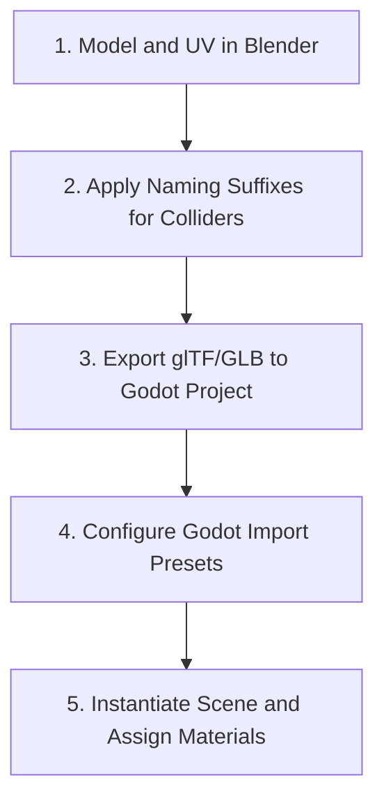

# Blender to Godot 4 Asset Import Procedure

This skill orchestrates Blender 3D DCC asset authoring and Godot 4 glTF import pipeline automation.

## Pipeline Workflow



---

## Step 1: Blender Export Naming Conventions

Godot 4's glTF importer parses object name suffixes in Blender to auto-generate Godot scene nodes:

| Suffix | Generated Godot Node | Use Case |
| --- | --- | --- |
| `Name-col` | `StaticBody3D` + `CollisionShape3D` (Concave Trimesh) | Static level geometry, floors, walls. |
| `Name-convcol` | `StaticBody3D` + `CollisionShape3D` (Convex Hull) | Dynamic props, barrels, crates. |
| `Name-colonly` | `StaticBody3D` + `CollisionShape3D` (No MeshInstance) | Invisible collision boundaries. |
| `Name-navmesh` | `NavigationRegion3D` source geometry | Navmesh bake bounds. |
| `Name-occ` | `OccluderInstance3D` | Occlusion culling geometry. |

---

## Step 2: Blender glTF 2.0 Export Settings

Export `.glb` binaries directly into `res://assets/models/` with these settings:

- **Format**: `glTF Binary (.glb)`
- **Transform**: `+Y Up`
- **Geometry**: Enable `Apply Modifiers`, `UVs`, `Normals`, `Tangents`
- **Materials**: `Export Materials` (or placeholder materials if overriding in Godot)

---

## Step 3: Configure Godot Import Settings

Execute import configuration via Godot Engine MCP:

```text
godot_configure_gltf_import(
    source_path="res://assets/models/character.glb",
    generate_lods=true,
    create_shadow_meshes=true,
    import_materials_as_built_in=false
)
```

---

## Step 4: Instantiate and Assign Materials

Instantiate the imported mesh into a scene and assign PBR materials:

```text
godot_instantiate_model(
    model_path="res://assets/models/character.glb",
    parent_path="World",
    node_name="CharacterModel"
)

godot_create_material(
    material_path="res://resources/materials/character_pbr.tres",
    albedo_texture_path="res://assets/textures/character_albedo.png",
    roughness_texture_path="res://assets/textures/character_roughness.png",
    normal_texture_path="res://assets/textures/character_normal.png"
)
```
