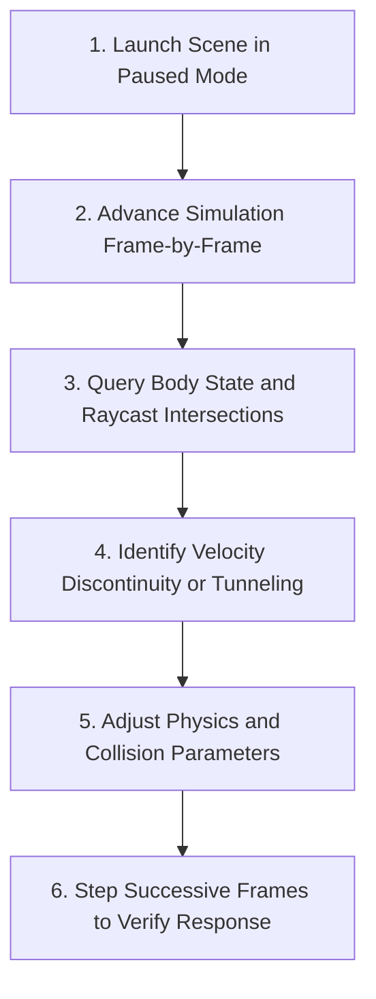

# Frame-by-Frame Physics Simulation Debugging Procedure

This skill provides an interactive procedure for diagnosing physics tunneling, jitter, collision edge cases, and frame-rate-dependent gameplay bugs in Godot 4.

## Simulation Debugging Workflow



---

## Step 1: Launch Scene in Paused State

Launch the target test level in paused mode so physics processing freezes at frame 0:

```text
godot_play_scene(scene_path="res://scenes/levels/test_arena.tscn", paused=True)
```

---

## Step 2: Step Physics Frames and Query Telemetry

Advance execution by a single physics tick and probe rigid body states and ray intersections:

```text
# Advance 1 physics frame
godot_set_play_state(frame_step=True)

# Probe character physics state
godot_get_body_physics_state_3d(node_path="World/Player")

# Cast diagnostic ray to check ground distance
godot_cast_ray_3d(
    from_point=[0.0, 1.0, 0.0],
    to_point=[0.0, -1.0, 0.0],
    collision_mask=1
)
```

---

## Step 3: Diagnostic Decision Matrix

| Physics Anomaly | Cause | Remediation |
| --- | --- | --- |
| **Tunneling Through Thin Walls** | High velocity displacement exceeds collider thickness in 1 frame. | Enable `continuous_cd = true` or increase wall collider depth. |
| **Jitter on Slopes** | Floor snapping disabled or snap distance too small. | Set `floor_snap_length = 8.0` on CharacterBody. |
| **Stuck on Floor Seams** | Discrete tile collision boxes creating internal edge catch points. | Merge collision polygons or use smooth ConcavePolygonShape2D. |
| **Physics / FPS Desync** | Movement logic placed in `_process()` instead of `_physics_process()`. | Migrate all velocity calculations into `_physics_process(delta)`. |

---

## Step 4: Verify and Tune

Step through 10 to 30 successive frames while inspecting body velocity, collision contacts, and position delta to ensure stability across varying frame deltas.
