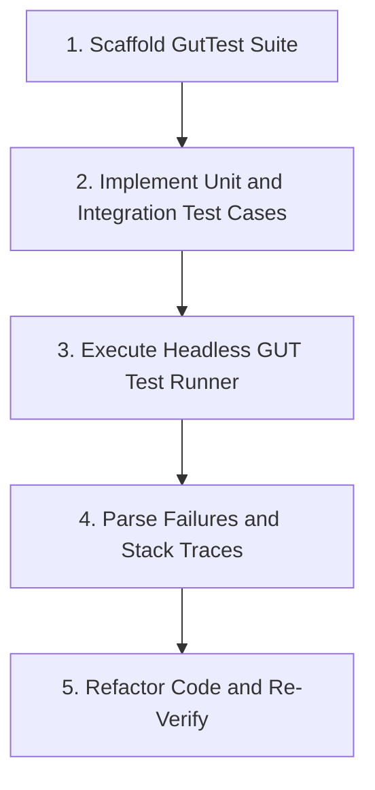

# Headless GUT Unit Testing Procedure

This skill provides a procedure for generating and executing automated test suites in Godot 4 using the Godot Unit Testing (GUT) framework.

## Testing Workflow



---

## Step 1: Scaffold GutTest Script

Generate a `GutTest` script for the target system under `res://test/unit/`:

```gdscript
# test_player_health.gd
extends GutTest

var player_scene: PackedScene = preload("res://scenes/characters/player.tscn")
var player: CharacterBody2D

func before_each() -> void:
    player = player_scene.instantiate() as CharacterBody2D
    add_child_autofree(player)

func test_initial_health_is_maximum() -> void:
    assert_eq(player.current_health, 100, "Player should start with 100 health")

func test_taking_damage_reduces_health() -> void:
    player.apply_damage(25)
    assert_eq(player.current_health, 75, "Health should reduce to 75 after 25 damage")

func test_damage_emits_signal() -> void:
    watch_signals(player)
    player.apply_damage(10)
    assert_signal_emitted(player, "health_changed", "health_changed signal must be emitted")

func test_lethal_damage_triggers_death() -> void:
    watch_signals(player)
    player.apply_damage(100)
    assert_signal_emitted(player, "health_depleted", "health_depleted must fire on 0 HP")
```

---

## Step 2: Execute Headless Test Runner

Execute GUT headlessly using Godot Engine MCP:

```text
godot_run_gut_tests(
    test_directory="res://test/unit",
    log_level=2
)
```

Or via CLI command line:

```bash
godot --headless -s addons/gut/gut_cmdln.gd -gdir=res://test/unit -gexit
```

---

## Step 3: Assertion Diagnosis and Fixes

- **`assert_eq(actual, expected)`**: Checks value equality.
- **`assert_almost_eq(actual, expected, tolerance)`**: For floating point physics comparisons.
- **`assert_signal_emitted(object, signal_name)`**: Verifies signal dispatch.
- **`assert_true(condition)` / `assert_false(condition)`**: Verifies boolean expressions.

Analyze failure reports, line numbers, and actual vs expected values, apply the code fix, and re-run tests until all suites pass with 0 failures.
