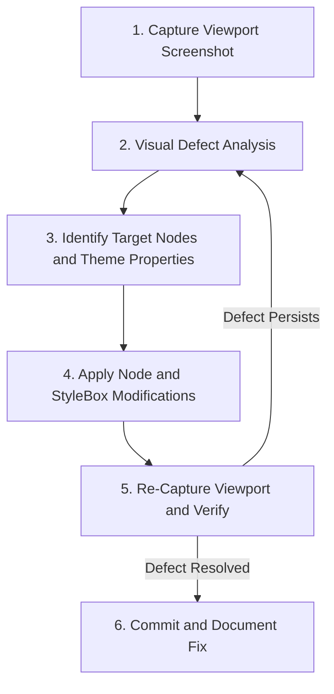

# Viewport and UI Visual Debugging Procedure

This skill provides an iterative procedure for inspecting, diagnosing, and resolving visual defects in Godot 2D/3D scenes and Control UI hierarchies using viewport capture tools.

## Visual Debugging Workflow



---

## Step 1: Capture Viewport Screenshot

Use Godot Engine MCP tools to capture the active editor or runtime viewport:

```text
# Capture main editor 2D/3D viewport
godot_take_screenshot(viewport_type="main_2d_3d")

# Capture running gameplay window
godot_take_screenshot(viewport_type="runtime")
```

---

## Step 2: Diagnostic Inspection Matrix

When analyzing UI and visual rendering defects, check against these common failure modes:

| Visual Symptom | Root Cause | Remediation Action |
| --- | --- | --- |
| **Control UI Clipping / Overflow** | Parent container lacks `clip_contents = true` or min size is too large. | Set `custom_minimum_size` on parent or adjust child size flags. |
| **Button Text Cut Off** | Font size exceeds container bounds or padding is insufficient. | Adjust `theme_override_font_sizes` or increase StyleBox margins. |
| **Uneven Grid / Flex Layout** | Children lack proper `size_flags_horizontal = SIZE_EXPAND_FILL`. | Update size flags on all siblings in Container. |
| **Z-Fighting in 3D** | Two meshes overlap at the exact same spatial coordinate. | Offset one surface by `0.001` or adjust Camera3D `near`/`far` planes. |
| **Sprite Pixel Blurriness** | Default texture filtering set to Linear instead of Nearest. | Set `texture_filter = TEXTURE_FILTER_NEAREST` on CanvasItem. |
| **2D Layer Sorting Errors** | Sprites render in wrong draw order. | Enable `y_sort_enabled = true` on parent or adjust `z_index`. |

---

## Step 3: Mutate Node and Theme Properties

Apply corrective properties using Godot Engine MCP tools:

```text
# Modify node layout properties
godot_modify_node(
    node_path="UIManager/HUD/MarginContainer",
    properties={
        "theme_override_constants/margin_left": 24,
        "theme_override_constants/margin_top": 24,
        "theme_override_constants/margin_right": 24,
        "theme_override_constants/margin_bottom": 24
    }
)

# Apply global theme adjustments
godot_apply_theme_override(
    node_path="UIManager/HUD/HealthBar",
    theme_type="ProgressBar",
    property_name="font_size",
    value=18
)
```

---

## Step 4: Re-Capture and Validate

1. Capture a fresh screenshot with `godot_take_screenshot`.
2. Inspect the updated frame to confirm pixel alignment, margins, text readability, and layout responsiveness.
3. If defects remain, repeat diagnostic inspection on nested child nodes until resolution is achieved.
