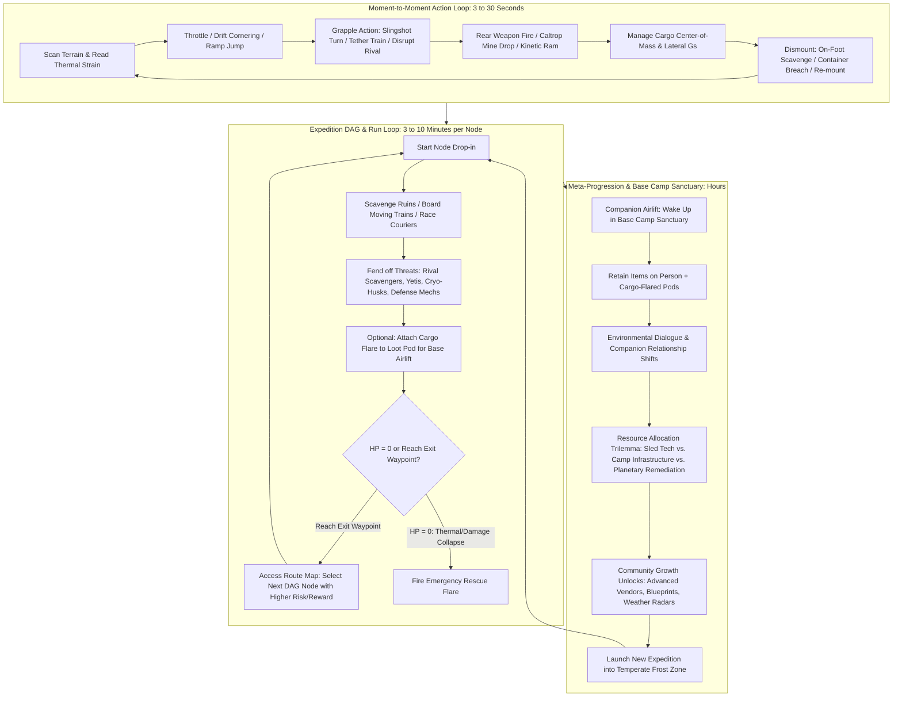
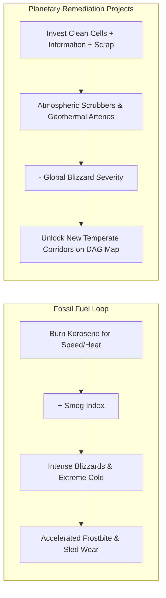
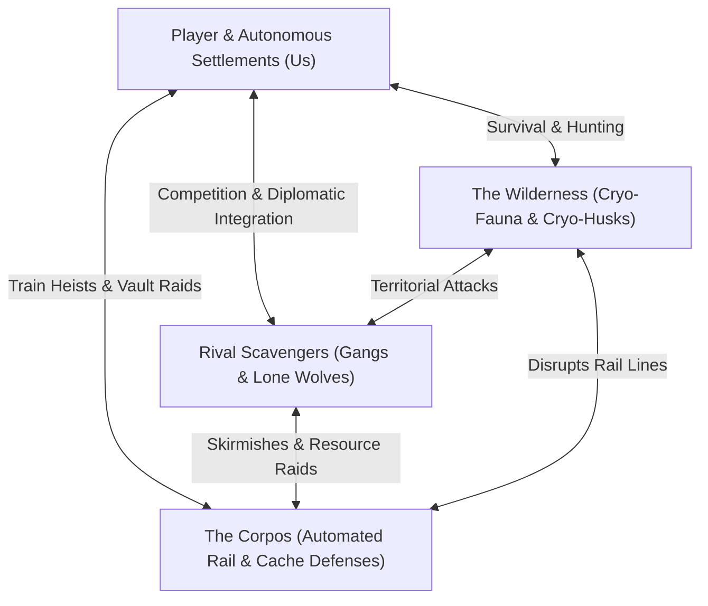
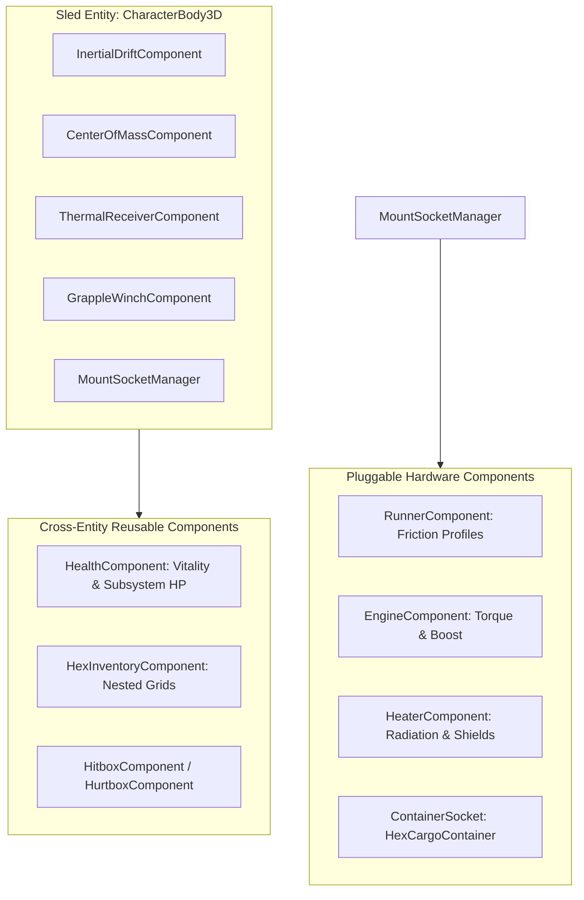

# Game Design Document: Drift

**Genre**: Isometric Sled-Action / Survival Rogue-Lite  
**Perspective**: 2.5D Isometric  
**Target Platform**: PC (Primary: Gamepad, Secondary: Keyboard & Mouse)  
**Engine**: Godot Engine 4.7+ (Forward+)  
**High-Concept Pitch**: *Hades* meets *Death Stranding* across a frozen, post-apocalyptic wasteland.

---

## 1. High Concept, Emotional Target, and Core Pillars

### 1.1 Premise and Fantasy
In a perpetually frozen post-apocalyptic world, players pilot high-mobility, rocket-assisted cargo sleds across treacherous ice sheets, fractured glaciers, and derelict industrial ruins. Beginning as an isolated scavenger scraping together scrap and fuel to survive the brutal cold, the player gradually connects with struggling frontier settlements. Over time, the scope widens from personal survival to communal stewardship, and ultimately to planetary reclamation—forcing players to confront the environmental cost of fossil fuels and the limits of extraction versus renewal.

### 1.2 Emotional Target and Player Experience
- **Kinetic Flow**: Achieving rhythmic, high-speed momentum through responsive drifting, grapple turns, jumps, and hazard navigation.
- **Tension of Exposure**: Managing the relentless frost that pushes against player health and stamina, where warmth is the only true shield.
- **Burden and Equilibrium**: Tactile satisfaction in managing physical cargo weight and inertia, mirroring ethical trade-offs between self-preservation, communal prosperity, and long-term planetary recovery.
- **Resilient Recovery**: Reaching zero health is not a punishing dead end, but a diegetic distress call that brings the player back to camp for rest, maintenance, social interaction, and strategic planning.

### 1.3 The Three Governing Design Pillars

```
+-------------------------------------------------------------------------------+
|                             THE 3 DESIGN PILLARS                              |
+-------------------------------------------------------------------------------+
| 1. KINETIC MASTERY & TETHERED LOCOMOTION                                      |
|    Vehicle handling is the core skill ceiling: acceleration, friction shifts, |
|    handbrake drifts, elevation jumps, and grapple hook slingshots/tethers.     |
+-------------------------------------------------------------------------------+
| 2. EQUILIBRIUM ACROSS SCALES                                                  |
|    Balance governs every system: cargo center-of-mass on the sled, thermal    |
|    stamina vs. exertion, extraction vs. sustainability, and self vs. commune. |
+-------------------------------------------------------------------------------+
| 3. FAILURE AS RESPITE AND RECONSTITUTION                                      |
|    Defeat is never a reset to zero. Firing the emergency flare triggers       |
|    retrieval by allies, transitioning the run into a sanctuary phase of rest, |
|    repairs, crafting, relationship progression, and world state updates.      |
+-------------------------------------------------------------------------------+
```

### 1.4 Spatial Perspective and Control Philosophy
- **Camera**: Fixed-angle 2.5D Isometric with dynamic camera leading (panning ahead along the sled velocity vector) and smooth framing adjustments during high-speed grapples and heists.
- **Controls**:
  - *Gamepad (Target Standard)*: Analog steering with progressive trigger acceleration/braking, dedicated drift button, right-stick aiming for grapple/tether launch, and d-pad quick management.
  - *Keyboard & Mouse*: WASD steering/throttle, Spacebar drift/jump, Mouse cursor aiming for grapple hook deployment.

### 1.5 The Environmental Core: Resource Scarcity and Degradation
- **Non-Renewable vs. Renewable**:
  - *Fossil Fuels / Ancient Batteries*: Provide immediate high-output thrust, heat, and quick profits, but emit smog and accelerate local blizzards and environmental toxicity.
  - *Thermal / Kinetic / Geothermal Recycling*: Slower to generate and requires infrastructure investment, but stabilizes local microclimates and camp sustainability.
- **Planetary Remediation**: Endgame systems allow players to divert critical personal and community assets into atmospheric scrubbers, geothermal vents, and biosphere beacons to reverse ecological collapse at tangible economic sacrifice.

---

## 2. Three-Tier Gameplay Loops



### 2.1 Moment-to-Moment Action Loop (3 to 30 Seconds)
1. **Terrain Reading & Friction Transitions**: The player monitors transitions between slick black ice (zero friction, high drift angle), hard-packed powder (optimal steering grip), jagged scree (high hull wear), and deep snowdrifts (heavy drag).
2. **Inertia & Cargo Equilibrium**:
   - In standard cruising, cargo straps hold firm.
   - During aggressive combat maneuvers (hard handbrake snaps, boost thrust, high-G turns, collision impacts), cargo loads shift along the physical sled rack. If lateral forces exceed threshold tolerances, the sled tips or rolls, dislodging unstrapped cargo and throwing the pilot.
3. **Versatile Tactical Verbs**:
   - *Grapple Harpoon*: Slingshot around pylons for sharp 90/180-degree turns, tether onto enemy sleds to destabilize their steering, or latch onto moving trains to match velocity.
   - *Mounted Rear-Defense*: Aim and fire rear weapons (e.g., kinetic slug guns, EMP pulse cannons, cryo-mines, scrap caltrops) to deter pursuers.
   - *Dismount & Physical Scavenging*: Jump off the sled in active environments, physically breach salvage containers, haul heavy items to the sled rack, tie them down, and re-mount under pressure.

### 2.2 Session / Expedition Loop (The DAG Route)
- **Directed Acyclic Graph (DAG) Structure**:
  - Expeditions are multi-stage journeys structured as a branching route map (inspired by *The Last Stand* / *Slay the Spire*).
  - The expedition starts in a relatively temperate outer rim. Each completed run leads to an exit waypoint where the player chooses their next destination node.
  - Deeper nodes present exponentially harsher cold, violent blizzards, and deadlier threats, balanced by rare ancient technology and high-density scrap caches.
- **Node Encounter Archetypes**:
  1. **Scavenger Runs & Derelict Industrial Complexes**: Exploring sprawling abandoned facilities. High-density loot guarded by territorial cryo-fauna (frost beasts / yetis), reanimated cryo-husks, and malfunctioning automated security mechs from the old civilization. Rival scavengers dynamically enter to contest salvage.
  2. **High-Speed Train Heists**: Intercepting automated or mercenary-guarded armored trains racing across frozen rail lines. Players grapple the train, match speed, jump aboard on foot to eliminate guards and loot vaults, and jump back onto their rolling sled before rail tunnels or bridges collapse.
  3. **Courier Sprints & Rival Intercept Races**: Sprinting between relay drop points against aggressive AI rival couriers, racing to secure high-value supply canisters under rapidly dropping core temperatures.
- **Run Continuity & Extraction Philosophy**:
  - An expedition does not end by simply "turning around." Players push forward node by node until their health/stamina hits zero and they fire their distress flare.

### 2.3 Meta-Progression & Base Camp Sanctuary Loop
- **Diegetic Rescue & Cargo Preservation**:
  - Upon collapse, the player fires their emergency flare. Their companion swoops in with a heavy recovery rig to airlift the pilot back to the Base Camp.
  - **The Cargo Flare Economy**: Everything in the sled's physical cargo hold is abandoned during emergency extraction *unless* the player affixed scarce **Cargo Flares** to specific containers during the run. Flared containers are retrieved by the companion and delivered to the camp stockpile.
  - Items, data drives, and compact tools carried on the player's personal suit harness are always preserved.
- **Camp Resource Allocation & Synergy**:
  - **Personal Sled & Pilot Tuning**: Sled chassis weight/durability, engine thrust curves, heated cabin suits, advanced grapple winches, weapon racks, and cargo strap stabilization.
  - **Communal Infrastructure**: Investing scrap and fuel into camp furnaces, medical infirmaries, scrap refineries, and radio towers. Upgrading the commune directly unlocks higher-tier blueprints, expands merchant inventories, and provides companion passive bonuses during future runs.
  - **Planetary Remediation**: Funneling massive quantities of refined materials and pristine filters into world scrubbers and geothermal regulators, permanently shifting global weather, opening new DAG corridors, and mitigating blizzard severity across future expeditions.
- **Narrative & Environmental Storytelling**:
  - Minimalist, atmospheric storytelling (inspired by *Dark Souls* and *Death Stranding*). Story unfolds through radio transmissions, ancient structural ruins, recovered memory cores, and evolving relationships with the rescue companion and camp survivors.

---

## 3. Player Verbs, Controls, and Locomotion Feel

### 3.1 Sled Physics & Surface Matrix
Sled locomotion uses an **Inertial Friction Model**. The vehicle maintains its linear velocity vector ($\vec{v}$) while steering torque alters the facing angle ($\theta$). Lateral grip ($\mu_{lat}$) and rolling drag ($\mu_{long}$) dynamically transition depending on the underlying terrain surface.

| Surface Type | Lateral Friction ($\mu_{lat}$) | Longitudinal Drag ($\mu_{long}$) | Handling Characteristics & Tactical Impact |
| :--- | :--- | :--- | :--- |
| **Black Ice** | $0.05$ (Near Zero) | $0.02$ | Pure inertia. Sled rotates freely without changing travel direction. Handbrake initiates endless slides. |
| **Packed Snow (Pack)** | $0.75$ (High Grip) | $0.15$ | Standard cruising surface. Predictable apex carving, fast handbrake bite, optimal drift control. |
| **Powder** | $0.45$ (Moderate Grip) | $0.55$ (High Drag) | Heavy rolling resistance. Slows top speed, creates trailing snow plumes that blind tailgaters. |
| **Slush** | $0.30$ (Low Grip) | $0.40$ (Variable Drag) | Hydroplaning hazard. Sluggish steering response; sudden friction spikes can destabilize high-speed turns. |
| **Snirt (Snow + Grit)** | $0.85$ (Aggressive Grip) | $0.35$ | Sharp steering bite, high tire/runner abrasive wear. Triggers sudden high lateral G-forces. |
| **Permafrost Scree** | $0.60$ (Bumpy Grip) | $0.25$ | Uneven rock bed. Causes sled shudder, jostles unstrapped cargo, inflicts chassis wear if hit at speed. |

```
               [SLED LOCOMOTION VECTOR MODEL]

               Forward Heading (θ)
                     ▲
                    / \
                   /   \
                  / SLED\
                 +-------+
                    / \
                   /   \
                  /     \
                 ▼       ▼
      [Lateral Slip Force]   ====>   [Momentum Vector: v]
      (Determined by Surface μ)       (Inertia preserved until friction catches)
```

### 3.2 Cargo Equilibrium & Center-of-Mass ($\vec{COM}$)
- **Hex-Based Modular Cargo Grid**:
  - The sled bed features a spatial hexagonal grid.
  - Containers come in upgradeable geometric profiles (single cell, triangle triple, long 4-hex bar, 7-hex heavy vault).
  - Every salvaged item has an intrinsic mass ($m_i$) and hex footprint.
- **Center-of-Mass Calculation**:
  $$\vec{COM} = \frac{\sum m_i \cdot \vec{r}_i}{\sum m_i + M_{sled}}$$
  - If $\vec{COM}$ shifts significantly off the longitudinal centerline or sits too far aft/fore:
    - *Aft Bias*: Front runners lose bite, severe understeer.
    - *Fore Bias*: Heavy nose drag, oversteer on ice.
    - *Lateral Bias*: Tipping hazard increases when cornering toward the heavy side.
- **Diegetic Tipping Warnings & Active Weight Shifting**:
  - Tipping is communicated via:
    1. Visual chassis tilt and runner sparks.
    2. Audio cues: metal groaning and cargo strap tension creaks.
    3. HUD roll-stability indicator.
  - **Active Pilot Counter-Lean**: The pilot can shift their physical weight using the steering/lean axis, countering lateral roll moment to keep runners grounded during high-G turns.

### 3.3 Elevation, Jumps, and Traversal
- **Natural Ramp Launches**: Conserving momentum over snow crests, jagged ice ridges, and industrial catwalks launches the sled into ballistic trajectories.
- **Air Pitch & Roll Control**: Subtle thruster attitude control while airborne allows the player to align runners with downhill slopes to avoid crash damage.
- **Pilot Mobility Equipment (Included in Vertical Slice)**:
  - **On-Foot Jetpack**: Pilot thruster harness allowing vertical burst leaps, hovering over crevasses, and jumping between moving train roofs and the sled.
  - **Sled Hop Thrusters (Late)**: Chassis-mounted vertical thrusters for clearing small crevasses and rail obstacles.

### 3.4 Winch & Grapple Architecture (Vehicle vs. Pilot)
1. **Sled Heavy Winch System**:
   - High-torque, long-range vehicle-mounted harpoon winch.
   - **Static Anchors**: Slingshot orbital turns around pylons, conserving momentum around sharp $90^\circ/180^\circ$ corners.
   - **Dynamic Anchors & Auto-Tether**: Latching onto moving trains or heavy haulers matches velocity. When the pilot dismounts, the sled's heavy winch automatically maintains a loose magnetic towline, keeping the sled tracking parallel to the moving target.
2. **Pilot Short-Range Utility Grapple**:
   - Compact, wrist-mounted magnetic grapple.
   - **Cargo Maneuvering**: Dragging, lifting, and loading heavy salvage crates into sled sockets.
   - **Grapple-Boarding**: Firing at the player's own moving sled reels the pilot directly back into the cockpit in a continuous acrobatic mount.
   - **Climbing**: Latching onto train side ladders and container catwalks.

### 3.5 Dismounting, Scavenging & Combat Verbs
- **Boarding Action & Scavenging On Foot**:
  - Pressing Dismount leaps the pilot off the sled into full 360° twin-stick locomotion.
  - The sled maintains tracking via the heavy winch umbilical.
- **Hex Inventory UI (Full Pause)**:
  - Accessing inventory completely pauses the simulation, allowing clean, deliberate spatial organization of modular hex containers without stressful UI interference.
- **Pilot Weaponry & The Plasma Cutter**:
  - **Plasma Cutter (Hybrid Melee & Breaching Tool)**:
    - *Combat Mode*: High-energy melee sweep that cleaves through cryo-swarmers and punctures corpo armor plates.
    - *Breaching Mode*: Cuts through heavy vault locks, welded cargo pod latches, and sealed train loading bay doors.
  - **Hand Blaster & Long Blaster**: Ranged kinetic options for suppression and precision armor piercing.

### 3.6 Complete Dual-Mode Control Mapping

```
+-----------------------------------------------------------------------------------------------+
| ACTION                   | GAMEPAD (Xbox / PS)              | KEYBOARD & MOUSE                |
+--------------------------+----------------------------------+---------------------------------+
| VEHICLE MODE             |                                  |                                 |
| Throttle / Accelerate    | Right Trigger (RT / R2)          | W / Shift (Configurable)        |
| Brake / Reverse          | Left Trigger (LT / L2)           | S / Ctrl                        |
| Steer / Turn             | Left Stick (Analog X-axis)       | A / D                           |
| Pilot Counter-Lean       | Left Stick (Hold LB) / Lean      | Q / E                           |
| Handbrake / Drift        | Face Button A / Cross (or RB)    | Spacebar                        |
| Sled Winch Quick-Shot    | Left Bumper (LB / L1)            | Right Mouse Button (RMB)        |
| Sled Winch Aim & Fire    | Right Stick Aim + RT             | Mouse Aim + RMB (Hold & Drag)   |
| Sled Winch Reel-In       | Hold Left Bumper (LB / L1)       | Hold RMB / Middle Click         |
| Fire Rear Weapon / Mine  | Face Button B / Circle           | Left Mouse Button (LMB)         |
| Dismount Sled / Board    | Face Button Y / Triangle         | F / E                           |
| Hex Cargo Manager        | View / Back / Touchpad (Pauses)  | Tab (Pauses)                    |
+--------------------------+----------------------------------+---------------------------------+
| ON-FOOT MODE             |                                  |                                 |
| Move / Walk              | Left Stick (360 Analog)          | W / A / S / D                   |
| Aim Weapon / Grapple     | Right Stick (Twin-Stick)         | Mouse Cursor                    |
| Fire Hand/Long Blaster   | Right Trigger (RT / R2)          | Left Mouse Button (LMB)         |
| Swing Plasma Cutter      | Right Bumper (RB / R1)           | Middle Mouse Click / F          |
| Pilot Short-Grapple Pull | Left Bumper (LB / L1)            | Right Mouse Button (RMB)        |
| Grapple-Board Own Sled   | Aim at Sled + Tap LB             | Aim at Sled + Tap RMB           |
| Sprint / Evade Roll      | Face Button A / Cross            | Spacebar / Shift                |
| Jetpack Jump / Hover     | Hold Face Button A in Air        | Hold Spacebar in Air            |
| Pick Up Cargo / Breach   | Face Button X / Square           | E                               |
| Mount Sled (Proximity)   | Face Button Y / Triangle         | F                               |
| Attach Cargo Flare       | D-Pad Up (near container)        | C                               |
| Fire Emergency Flare     | Hold D-Pad Down (when HP = 0)    | Hold R (when HP = 0)            |
+--------------------------+----------------------------------+---------------------------------+
```

---

## 4. Systems, Progression, and Balance Economy

### 4.1 Vitality, Thermal Shielding, and Sled Subsystems

```
[VITALITY & THERMAL ARCHITECTURE]

                     +---------------------------------------+
                     |       Active Thermal Shield (H)       |  (Heater / Warmth Zones)
                     +---------------------------------------+
                                        │ Absorbs Cold
                                        ▼
+-----------------------------------------------------------------------------------+
| Frostbite Zone (Cold Damage) |  Usable Stamina Drain  |   Effective Vitality (V)  |
+-----------------------------------------------------------------------------------+
 0                             20                       60                         100
 (If H = 0, Cold creeps left-to-right, shrinking max usable Vitality)
```

1. **Vitality & Stamina**:
   - Total health and physical exertion draw from a unified pool ($V_{max} = 100$).
   - Sprinting, heavy grapple pulls, and hauling cargo consume temporary stamina from $V$, which recharges rapidly when stationary or cruising smoothly.
   - Physical impacts, bullet wounds, and cryo-beast attacks directly cut $V$.
2. **Thermal Shield ($H$) & Frostbite Mechanics**:
   - Heat ($H$) acts as an ablative shield against the freezing environment.
   - While $H > 0$, ambient blizzard sub-zero temperatures inflict zero vitality loss.
   - When $H = 0$, **Frostbite** accumulates at a rate proportional to the sector's temperature and wind chill ($\frac{dF}{dt} = k_{cold} \cdot (1 + \text{SmogIndex})$).
   - Frostbite permanently freezes the maximum cap of $V$ until the player reaches a heat source (sled heater, geothermal vent, or thermite beacon).
3. **Modular Sled Subsystems Integrity**:
   The sled is composed of discrete physical modules with independent health pools ($0 - 100\%$):
   - **Chassis / Hull Plating**: Absorbs ramming impacts; failing hull risks spilling hex cargo.
   - **Engine / Thruster Array**: Governs acceleration curves and top speed; damaged engines sputter, misfire, and lose torque.
   - **Heater Unit**: Radiates heat to sustain cabin/pilot $H$; damaged heaters leak heat, requiring more frequent stops at vents.
   - **Ski Runners**: Governs lateral friction $\mu_{lat}$ and drift control; damaged runners pull to one side and suffer extreme friction on snirt/scree.
   - **Grapple Winch Assembly**: Governs cable tension limits and reel speed; damaged winches risk cable snapping under heavy dynamic loads (e.g., train heists).

### 4.2 Comprehensive Resource & Item Taxonomy

```
+-----------------------------------------------------------------------------------------------+
| CATEGORY          | ITEMS & MANIFESTATIONS       | ECONOMIC & GAMEPLAY FUNCTION               |
+-------------------+------------------------------+--------------------------------------------+
| MATERIALS         | • Scrap Metal & Alloys       | Sled field repairs, hull armor, camp shops |
|                   | • Salvaged Wood & Timber     | Camp construction, emergency furnace burn  |
|                   | • Heavy Cloth & Fiber Weaves | Thermal suit insulation, cargo tie-downs   |
+-------------------+------------------------------+--------------------------------------------+
| SUSTENANCE        | • Preserved Rations & Food   | Baseline pilot health regen, camp morale   |
|                   | • Meltwater / Pure Filters   | Camp hydroponics, engine coolant systems   |
+-------------------+------------------------------+--------------------------------------------+
| ENERGY & FUELS    | • Fossil Fuel (Kerosene)     | High boost thrust, fast heat (dirty/smog)  |
|                   | • Geothermal / Clean Cells   | Sustainable camp energy, clean engine tech |
|                   | • Thermite Flares            | Deployable temporary localized heat zones  |
+-------------------+------------------------------+--------------------------------------------+
| COMBAT & DEFENSE  | • Kinetic Slug Ammo / Harpoons| Sled rear-cannon and on-foot sidearm ammo  |
|                   | • Scrap Caltrop Mines        | Deployable pursuer hazard (drifts/traps)   |
|                   | • EMP Disruptor Charges      | Disables enemy sled electronics & mechs    |
+-------------------+------------------------------+--------------------------------------------+
| EXTRACTION        | • Cargo Flares               | Single-use beacons to airlift cargo on HP=0|
+-------------------+------------------------------+--------------------------------------------+
| INFORMATION & LORE| • Books, Journals, Field Logs| Ancient technology blueprints, settlement  |
|                   | • Hard Drives, Video Tapes   | lore, environmental research, NPC dialogue |
+-------------------+------------------------------+--------------------------------------------+
```

### 4.3 Environmental Degradation vs. Planetary Remediation



- **The Smog Dynamics**:
  - Burning fossil fuels provides explosive acceleration and rapid heat, but each liter consumed raises the sector's local **Smog Index**.
  - High Smog lowers visibility (fog-of-war shrinks) and increases frostbite accretion rates.
- **Planetary Remediation Projects**:
  - At Base Camp, the player and settlement elders can invest large quantities of Clean Cells, Structural Materials, and Research Data into three macro-projects:
    1. **Atmospheric Scrubber Arrays**: Permanently clears blizzard clouds and smog across connected sectors.
    2. **Geothermal Arteries**: Melts subterranean ice corridors, creating permanent high-speed highway routes that bypass hazardous mountain crags.
    3. **Biosphere Domes**: Restores natural vegetation and warm sanctuaries within the wasteland, generating free food, clean water, and wood supplies.

### 4.4 Progression Synergy: Communal Interdependence

```
[CAMP WORKSHOP & TECH DISCOVERY FLOW]

Scavenged "Information" (Books, Drives, Logs) + Raw Scrap / Wood / Cloth
                                │
                                ▼
         +─────────────────────────────────────────────+
         |     COMMUNITY RESEARCH & ARCHIVE HUB        |
         | (Settlement mechanics synthesize blueprints)|
         +─────────────────────────────────────────────+
                                │
              ┌─────────────────┴─────────────────┐
              ▼                                   ▼
    [Camp Infrastructure]               [Personal Sled Blueprints]
    • Tier 1-4 Furnace (Warmth)         • Reinforced Alloy Skis
    • Infirmary (Vitality Buffs)        • High-Torque Grapple Winches
    • Radio Relay (DAG Map Intel)       • Hex Vault Expansion Modules
```

- **Lore-Driven Tech Gating**:
  - The solitary scavenger cannot manufacture advanced aerospace sled runners or geothermal heaters alone.
  - Bringing **Information** items (manuals, engineering drives, field journals) to camp scholars triggers communal discoveries.
  - Upgrading the **Camp Workshop** unlocks higher-tier manufacturing tiers for the player's sled.
- **The Self vs. Community Dilemma**:
  - Resources stored in the player's private sled upgrade pool improve individual survivability on the next expedition.
  - Resources donated to the communal stockpile expand settlement facilities, open vendor trade inventories, improve the companion's recovery rig capabilities (e.g., extra cargo flares), and accelerate world remediation.

---

## 5. Level Flow, Pacing, and Threat Design

```
[THE 4-ZONE DAG WORLD TOPOLOGY]

   ZONE 1: Temperate Permafrost (Outer Rim)
   • Thinned ice sheets, abandoned highways, scattered scavenger huts, mild frost.
                    │
                    ▼
   ZONE 2: Glacial Chasms & Corpo Rail Arteries
   • Deep ice crevasses, frozen riverbeds, high-speed armored trains, pack ice.
                    │
                    ▼
   ZONE 3: Derelict Industrial Megastructures
   • Heavy factory ruins, chemical slush, toxic refineries, automated defense nets.
                    │
                    ▼
   ZONE 4: The Dead Core (Extreme Sub-Zero Abyss)
   • Perpetual whiteout storms, ancient mainframe bunkers, pure geothermal rifts.
```

### 5.1 The Four Governing Factions



1. **The Autonomous Settlements & Player ("Us")**:
   - Resilient, cooperative human enclaves striving for thermal stability, shared technology, and long-term ecological remediation.
2. **Rival Scavengers**:
   - Opportunistic, desperate survivors. They drive makeshift, agile sleds, compete for active salvage nodes, and ambush players during transport runs.
   - **Community Integration Loop**: A key mid-to-late game mechanic involves winning over or negotiating with rival scavengers. Donating surplus rations, medical supplies, and heat cells allows the player's camp to absorb rival factions, turning dangerous hostiles into friendly trade caravans and AI escorts.
3. **The Megacorporations ("Corpos")**:
   - The cold, automated remnants of the pre-collapse corporate elite.
   - They operate the massive, armored high-speed freight trains cutting across the continent and protect fortified vault caches.
   - **Forces**: 100% robotic and autonomous (Sentry Drones, Rail Defense Sentinels, Heavy Walker Guards, Automated Railgun Turrets).
   - **Armored Train Heist Anatomy & Tactical Options**:
     - *Decoupling the Cars*: The pilot can board the roof between cars and pull/cut the mechanical coupler lever, cleanly detaching the rear freight cars so they roll to a stop on the open track for safe scavenging.
     - *In-Motion Interior Breach*: The pilot can use the **Plasma Cutter** or heavy blaster fire to blow open the exterior side loading bay doors, entering the moving train car interior to fight robotic sentinels and loot high-tier vault containers while the train continues racing forward.
4. **The Wilderness (Cryo-Fauna & Cryo-Husks)**:
   - *Cryo-Fauna*: Endemic mutant creatures adapted to absolute zero (Glacial Yetis, Burrowing Snow Swarmers, Razor-Beak Stalkers).
   - *Cryo-Husks*: Deep-game frozen human laborers and cybernetically preserved workers trapped in sub-zero suspended animation, reanimating within interior ruins and derelict vaults.

### 5.2 Threat Taxonomy & Player Counterplay Matrix

```
+---------------------------------------------------------------------------------------------------------+
| FACTION        | UNIT ARCHETYPE             | TACTICAL BEHAVIOR               | PLAYER COUNTERPLAY      |
+----------------+----------------------------+---------------------------------+-------------------------+
| RIVAL          | • Harpoon Skiff (Light)    | Fast flanking; tethers player   | Handbrake drift-cut;    |
| SCAVENGERS     |                            | sled to pull them off-line      | drop scrap caltrops     |
|                | • Scrap Enforcer (Medium)  | High-speed kinetic ramming;     | Grapple-slingshot behind|
|                |                            | rear-mounted slug cannon        | to strike weak engine   |
|                | • Wasteland Sniper (Foot)  | Long-range anti-material rifle  | Smoke plume / fast drift|
+----------------+----------------------------+---------------------------------+-------------------------+
| THE CORPOS     | • Corpo Sentry Drone       | Hovering laser tracking & ping; | Harpoon quick-shot pull |
| (AUTOMATA)     |                            | calls rail reinforcements       | into ground / EMP shock |
|                | • Rail Defense Sentinel    | Armored rolling turret on train | On-foot flank boarding; |
|                |                            | cars; discharges EMP arcs       | breach with Plasma Tool |
|                | • Heavy Walker Guard       | Heavy shielding, mortar barrages| Kinetic harpoon drag to |
|                |                            | protecting corpo vault entrances| flip off permafrost edge|
+----------------+----------------------------+---------------------------------+-------------------------+
| THE WILDERNESS | • Glacial Yeti (Apex)      | Massive leaping shockwave smash;| Bait with thermal flare;|
| & CORRUPTION   |                            | attempts to roll/tip the sled   | boost-ram at top speed  |
|                | • Snow Swarmers            | Burrow under snow; latch onto   | 180° handbrake burn;    |
|                |                            | ski runners to multiply drag    | Plasma Cutter melee arc |
|                | • Cryo-Husks (Ruins)       | Shambling cold-resistant swarms | Plasma Cutter sweep &   |
|                |                            | in tight interior derelicts     | sprint-dodge spacing    |
+----------------+----------------------------+---------------------------------+-------------------------+
```

### 5.3 Dynamic Environmental Hazards & Geometry Barriers
- **Escalating Whiteout Conditions**:
  - Blizzards escalate dynamically from Light Flurry $\to$ Gale-Force Storm $\to$ Zero-Visibility Whiteout.
  - In a Whiteout, visual visibility drops to zero, radar is jammed, and cold damage accelerates to lethal rates, forcing players to locate shelter, fire a thermal beacon, or flee to the exit waypoint.
- **Physical Geometry Barriers (Boulders, Frozen Pines, Industrial Debris)**:
  - The wasteland is strewn with high-impact collision obstacles: glacial boulders, petrified frozen pine groves, rusted iron girders, and ancient concrete pillars.
  - Striking rigid barriers at high speed ($v > v_{threshold}$) inflicts massive kinetic damage to the sled's outer chassis/hull plating.
  - **Shock-Transmitted Subsystem Damage**: Severe collisions have a statistical chance ($\text{Chance} = k \cdot v_{impact}^2$) to transmit impact shock through the chassis into installed internal components:
    - *Engine*: Sparks, torque drops, or temporary stalls.
    - *Cabin Heater*: Ruptured thermal core, causing immediate heat leakage.
    - *Ski Runners*: Structural misalignment, pulling steering hard left/right.
    - *Grapple Assembly*: Snapped winch gears, disabling the tether until field repairs.
    - *Cargo Bed*: Cargo tie-down strap failure, dislodging hex containers.
- **Crevasse Fractures & Magnetic Recovery**:
  - Glacial rifts and cracking ice sheets create sudden chasm gaps.
  - Plunging down a crevasse inflicts heavy kinetic damage to both pilot Vitality and sled subsystem integrity ($25-40\%$ damage across all modules).
  - The sled's onboard **Emergency Magnetic Anchor** automatically engages, winching and respawning the damaged vehicle back onto the nearest stable crevasse ledge.
- **Power Lines & Overhead Snags**:
  - Drooping pre-collapse high-voltage cables and rusted structural cables cross valleys and race paths.
  - Striking a low line at high speed violently catches the chassis, instantly halting momentum, snapping cargo tie-down straps, and inducing a severe roll/tip.

### 5.4 Interstitial DAG Encounters & The Fuel-Starved Map
1. **Dynamic In-Between Node Encounters**:
   - While moving along DAG connection paths between major locations, random high-speed events can trigger:
     - **Rival Scavenger Ambush**: Warband sleds intercept the player along narrow canyon passes.
     - **Avalanche Escape**: A massive downhill snow wall collapses behind the player, requiring high-speed hazard avoidance and uninterrupted drift lines to outrun.
     - **Corpo Rail Patrol Intercept**: Sled cross-cuts a live corpo rail convoy under heavy drone surveillance.
2. **The Stranded Fuel-Starved Intercept**:
   - If a player attempts to travel to a distant node without meeting the minimum fuel/energy threshold, their engine stalls mid-route, dropping them into a **Stranded Pocket Map**.
   - *Characteristics*: A barren, sub-zero wasteland with scarce salvage, zero friendly warmth sources, and high ambient cold drain.
   - *Objective*: The player must scavenge emergency kerosene or clean cells from broken derelict sleds before hypothermia consumes their Vitality, reignite their engine, and resume the expedition.

---

## 6. Game Feel, Juice, and Audio-Visual Direction

### 6.1 Tactile Feedback & Camera Dynamics
- **Kinetic Hit-Stop & Screen Trauma**:
  - **Collision Impact**: 4–6 frame hit-freeze on heavy kinetic rams, train couplings, or yeti slams, followed by trauma-squared screen shake ($Shake = Trauma^2$).
  - **Runner Sparks & Friction Shaders**: High-velocity drifts across snirt or railway iron throw blinding spark showers and trigger subtle gamepad trigger vibration.
- **Dynamic Camera Rig & Occlusion Handling**:
  - **Velocity Leading**: The camera dynamically offsets along the sled's forward velocity vector ($\vec{v}$), giving the player extended sightlines into upcoming turns.
  - **Dynamic FOV & Zoom**: FOV widens smoothly during rocket boosts and orbital grapple slingshots, expanding peripheral hazard awareness, and snaps into a close isometric framing during on-foot vault breaches.
  - **Dithered Stencil Cutouts (Set Pieces Only)**:
    - When the sled or pilot passes behind large static geometry barriers (boulders, factory walls, massive ruin pillars), a circular dithered/translucent mask is applied to the occluding set piece.
    - *Interactable Objects (Loot containers, train couplers, enemy sleds) are strictly exempt from cutouts* to preserve physical tactical clarity.
- **Visual Juice & Diegetic Navigation**:
  - **Surface Roostertails**: High-density GPU particle plumes behind runners; light powder creates blinding white rooster plumes, snirt throws jagged grey grit, and slush leaves wet, reflective tracks.
  - **Diegetic Headlight Compass / Trajectory Ribbon**: In severe flurries or whiteouts, the sled's forward high-output headlights project a subtle thermal navigation ribbon onto the snow, guiding the pilot toward active train tracks or sector exit waypoints.
  - **Diegetic Hypothermia Vignette**: When Heat drops to zero ($H = 0$) and Frostbite accumulates, frosty crystalline ice actively creeps inward from the viewport borders with subtle chromatic aberration.

```
[VISUAL CONTRAST & COLOR LANGUAGE MATRIX]

  BLUE / CYAN                AMBER / ORANGE              GREEN / YELLOW
  Sub-Zero Frostbite         Warmth, Safety & Sanctuary  Corpo Tech & Automata
  Hostile Wilderness         Camp Hearth & Lanterns      Sentry Drones & Lasers
  Lethal Whiteout Hazards    Rescue & Cargo Flares       Toxic Waste & Rail Vaults
```

### 6.2 Art Direction & Color Theory
- **Aesthetic**: Stylized 2.5D Isometric Frostpunk. Sharp, high-contrast silhouettes cutting through vast glacial expanses.
- **Color Coding System**:
  - **Blue / Cyan**: Environmental cold, hypothermia frostbite, cracking ice sheets, hostile wilderness.
  - **Amber / Orange**: Safety, heat sources, geothermal vents, camp hearths, rescue flares, companion recovery beacons.
  - **Green / Yellow**: Corporate machinery, automated train engines, surveillance searchlights, rail defense sentry targeting arcs, toxic industrial waste.

### 6.3 Interactive Audio Architecture
- **Multi-Stem Dynamic Music System**:
  - **Exploration Layer**: Desolate acoustic instrumentation, distant wind resonance, and deep subterranean ice groans.
  - **Combat / Heist Layer**: Fast, industrial percussion, aggressive analog synthesizer basslines, and metallic rhythms that dynamically intensify based on sled speed and enemy proximity.
  - **Hypothermia Low-Pass Filter**: When Vitality/Heat falls into critical danger, external world audio is heavily muffled beneath an ominous low-pass filter, spotlighting the pilot's labored breathing and slowing heartbeat.
- **Foley & Sound Design**:
  - **Surface Textures**: Satisfying crunch on packed powder, crystalline hum on black ice, harsh metallic screech across snirt and scree.
  - **Hypothermia Cues**: Distinct, crisp ice-cracking audio as frostbite crystals physically spread across the screen borders.
  - **Mechanical Satisfaction**: Heavy pneumatic latches locking hex cargo in place, high-tension winch whirring during grapple turns, and the resonant *thunk* of launching an emergency distress flare.

---

## 7. Godot 4 Technical Architecture and MVP Milestones

### 7.1 Component-Based Entity Architecture (Composition over Inheritance)
Entities in *Drift* (Sleds, Pilot, Enemies, Train Cars, World Containers) are built using small, decoupled, single-responsibility **Node Components** paired with typed **GDScript 4.7+ Custom Resources**.



#### Reusable Component Registry
1. **`HealthComponent`**: Tracks generic integer/float health, damage mitigation, invulnerability ticks, and signals (`damaged`, `died`). Reused across Pilot, Sled Subsystems, Train Turrets, and Destructible Ruin Crates.
2. **`ThermalReceiverComponent`**: Samples local temperature field rays, calculates frostbite drain vs. active heat shielding ($H$), and emits signals for frostbite percentage and HUD crystallization.
3. **`InertialDriftComponent`**: Casts terrain probe raycasts to query the current hex surface type ($\mu_{lat}, \mu_{long}$), calculates momentum conservation, steering torque, lateral slip forces, and emits roll/pitch angles.
4. **`CenterOfMassComponent`**: Traverses all attached `ContainerSocket` nodes, calculates instantaneous composite mass and spatial center of mass $\vec{COM}$, and updates the sled's roll-instability factor.
5. **`HexInventoryComponent`**: Core spatial inventory logic with 2D axial hex coordinate math ($q, r$). Reused across Ground Containers, Pilot Backpack, and Sled Modular Pods.
6. **`SledWinchComponent`**: Heavy vehicle winch handling long-distance anchors, slingshot turns, and the auto-tether umbilical to moving trains.
7. **`PilotGrappleComponent`**: Short-range pilot wrist grapple for dragging cargo crates, climbing ladders, and grapple-boarding back onto the moving sled.
8. **`JetpackComponent`**: Pilot mobility harness providing burst vertical lift, crevasse hovering, and train-to-sled leaping.
9. **`WeaponSocketComponent`**: Standardized socket for firing rear sled ordinances, kinetic blasters, and swinging the Plasma Cutter.

### 7.2 Sled Modular Hardware & Custom Resources
The base sled chassis is a modular frame with hardware sockets. Installing different hardware components alters the sled's baseline capabilities:

```
+---------------------------------------------------------------------------------------------------+
| HARDWARE SOCKET     | COMPONENT ROLE                 | CUSTOM RESOURCE DATA SCHEMA (.tres)        |
+---------------------+--------------------------------+--------------------------------------------+
| RUNNER SOCKET       | Sets friction curves on ice,   | `RunnerData.tres`: friction_ice,           |
|                     | pack, powder, slush, snirt     | friction_snirt, wear_rate, max_steer_angle |
+---------------------+--------------------------------+--------------------------------------------+
| ENGINE SOCKET       | Sets torque curve, top speed,  | `EngineData.tres`: max_thrust, boost_mult, |
|                     | boost thrust, and fuel drain   | fuel_burn_rate, overheat_threshold         |
+---------------------+--------------------------------+--------------------------------------------+
| HEATER SOCKET       | Sets thermal shield max ($H$), | `HeaterData.tres`: thermal_radius,         |
|                     | heat recharge, and fuel use    | shield_capacity, efficiency_burn_rate      |
+---------------------+--------------------------------+--------------------------------------------+
| WINCH SOCKET        | Sets cable reach, tensile Gs,  | `WinchData.tres`: max_cable_length,        |
|                     | and winch reel-in force        | winch_force, break_tension_limit           |
+---------------------+--------------------------------+--------------------------------------------+
| CARGO BED SOCKETS   | Holds modular container pods   | `ContainerMountData.tres`: max_hex_volume, |
|                     | in various geometric shapes    | tare_mass, armor_rating                    |
+---------------------+--------------------------------+--------------------------------------------+
```

### 7.3 Hexagonal Geometry: Procedural World & Nested Inventory

```
[THE DUAL-LAYER HEXAGONAL ARCHITECTURE]

LAYER A: PROCEDURAL HEX WORLD MAP GRID
• Axial coordinates (q, r)
• Each hex tile represents a biome sector (Pack Ice, Black Ice Lake, Rail Line, Crevasse)
• Handles dynamic blizzard weather propagation and procedural road connectivity.

                     / \     / \
                    | q,r |---| q,r |
                     \ /     \ /
                      |
                      ▼
LAYER B: NESTED HEX INVENTORY SYSTEM
• Ground Crates / Derelict Vaults (Fixed World Sources)
      │ (Player scavenges on foot)
      ▼
• Pilot Backpack Container (Wearable 7-hex pocket)
      │ (Player loads onto vehicle)
      ▼
• Sled Modular Containers (Nestable pods installed into chassis bed)
```

1. **Layer A: Procedural Hexagonal World Grid & Geometry Barriers**:
   - World sectors are generated as interconnected hexagonal tiles using 2D axial coordinates $(q, r)$.
   - Hex tiles store elevation, terrain surface type, obstacle density, and thermal gradients.
   - **Static Geometry Barriers**: Procedural placement of high-density collision meshes:
     - *Glacial Boulders & Crags*: Static solid colliders that stop vehicles dead if hit directly.
     - *Petrified Frozen Pines & Ruin Pillars*: Destructible or rigid obstacles that deflect sled trajectory.
     - *Industrial Scrap Heaps & Rebar*: Inflict hull abrasion and runner snagging.
   - **Collision Physics & Component Damage Transmission**: Sled collisions with barriers calculate kinetic impact energy ($E_k = \frac{1}{2} M_{total} v^2$), directly cutting hull health and passing shock waves to internal hardware sockets based on chassis integrity.
   - Procedural generation stitches terrain chunks seamlessly and calculates continuous paths for train rails and rival courier routes.
2. **Layer B: Nested Hex Inventory Hierarchy**:
   - **Ground Containers**: Static world fixtures found in ruins and train cars. Cannot be moved; player opens on foot to retrieve individual hex items.
   - **Player Backpack**: Wearable container for quick scavenging on foot.
   - **Sled Containers**: Discrete modular pods (e.g., 3-hex triangle, 4-hex bar, 7-hex heavy vault) bolted onto the sled frame. Containers can be unbolted, upgraded, or rearranged to tune center-of-mass balance.

### 7.4 Pilot & Character Weaponry
Modular weapons use `WeaponSocketComponent` and are available in both on-foot and sled-mounted configurations:
- **Plasma Cutter (Hybrid Melee & Breaching Tool)**:
  - *Melee Swing*: High-damage plasma arc that cleaves cryo-swarmers and breaks through robotic armor plates.
  - *Breaching Utility*: Cuts locked cargo latches, opens frozen vault doors, and breaches train loading doors.
- **Hand Blaster**: Light kinetic sidearm, rapid semi-auto fire, low stamina drain. Ideal for picking off snow swarmers and clearing interior cryo-husks.
- **Long Blaster (Kinetic Slug Rifle)**: Heavy two-handed rifle with high armor penetration; knocks back enemies and damages corpo sentry weakpoints at the cost of high stamina drain.
- **Sled Harpoon & Caltrop Droppers**: Rear-mounted vehicle defenses for vehicle chases.

### 7.5 Scene Node Hierarchy Blueprint

```
res://
├── scenes/
│   ├── main/
│   │   └── Main.tscn                      # Game Coordinator & Autoload State Machine
│   ├── world/
│   │   ├── HexWorldGenerator.tscn         # Procedural Hex Tile World Generator
│   │   ├── SectorManager.tscn             # DAG Node Level Loader & Spawner
│   │   ├── DynamicWeather.tscn            # Blizzard & Smog Particle / Shader Systems
│   │   └── MovingTrain.tscn               # Corpo Train Car Assembly with Coupler Levers
│   ├── entities/
│   │   ├── sled/
│   │   │   ├── SledChassis.tscn           # Sled Host (CharacterBody3D) + Mount Sockets
│   │   │   └── SledHeavyWinch.tscn        # Raycast Harpoon, SpringJoint3D, Auto-Tether
│   │   ├── pilot/
│   │   │   ├── Pilot.tscn                 # On-foot CharacterBody3D, Dismount & Boarding
│   │   │   ├── PilotGrapple.tscn          # Short-range Wrist Harpoon (Cargo & Sled)
│   │   │   └── JetpackHarness.tscn        # Vertical Lift & Crevasse Hover Component
│   │   ├── enemies/
│   │   │   ├── RivalSled.tscn             # Rival Scavenger AI Sled
│   │   │   ├── Corpos/CorpoDrone.tscn     # Corpo Sentry Drone & Rail Sentinels
│   │   │   └── Fauna/GlacialYeti.tscn     # Apex Frost Beast
│   │   └── containers/
│   │       ├── GroundCrate.tscn           # Static World Loot Container
│   │       └── SledContainerPod.tscn      # Installable Hex Cargo Pod
│   ├── components/                        # Reusable Component Nodes
│   │   ├── HealthComponent.tscn
│   │   ├── ThermalReceiverComponent.tscn
│   │   ├── InertialDriftComponent.tscn
│   │   ├── CenterOfMassComponent.tscn
│   │   ├── HexInventoryComponent.tscn
│   │   ├── JetpackComponent.tscn
│   │   └── HitboxHurtboxComponent.tscn
│   ├── camera/
│   │   └── IsometricCameraRig.tscn        # Velocity-Leading, FOV Zoom, Stencil Cutout
│   ├── ui/
│   │   ├── HUD.tscn                       # Vitality, Heat, Tipping Indicator, Frost Vignette
│   │   ├── HexInventoryUI.tscn            # Full-Pause Drag-and-Drop Hex Cargo Grid
│   │   └── DAGRouteMapUI.tscn             # Branching Expedition Node Map
│   └── camp/
│       └── BaseCampSanctuary.tscn         # Hub Scene: Hearth, Workshop, Remediation
```

### 7.6 Vertical Slice Delivery Milestones

```
+---------------------------------------------------------------------------------------------------+
| MILESTONE                       | CORE DELIVERABLES                                               |
+---------------------------------+-----------------------------------------------------------------+
| MILESTONE 1:                    | • Inertial sled physics component with surface friction matrix. |
| KINETIC FEEL PROTOTYPE          | • Hexagonal inventory system with COM mass balance and tipping. |
| (Foundational Locomotion)       | • Sled Heavy Winch for orbital slingshot turns and tethering.   |
|                                 | • Modular sled hardware sockets (Runners, Engine, Heater).      |
|                                 | • 2.5D isometric velocity-leading camera with stencil cutouts.  |
+---------------------------------+-----------------------------------------------------------------+
| MILESTONE 2:                    | • Reusable HealthComponent + ThermalReceiver (Heat & Frostbite).|
| SURVIVAL, THREATS & HEISTS      | • On-foot pilot locomotion, short-grapple, and Jetpack harness. |
| (Systems & Combat)              | • Weapons: Plasma Cutter (melee + breach tool) & Hand Blaster.  |
|                                 | • Moving Train Heist with car decoupling and door breach.       |
|                                 | • AI threat prototypes: Rival Skiffs, Corpos, Glacial Yetis.    |
|                                 | • Emergency flare & Cargo flare airlift extraction mechanics.   |
+---------------------------------+-----------------------------------------------------------------+
| MILESTONE 3:                    | • Procedural Hexagonal World Sector Generator & DAG Route Map.  |
| THE COMPLETE VERTICAL SLICE     | • Fuel-starved stranded map transition.                         |
| (The Full Loop)                 | • Base Camp Sanctuary Hub: Resource allocation trilemma.        |
|                                 | • Dynamic multi-stem audio & hypothermia ice cracking shaders.  |
|                                 | • Complete run-to-camp loop verification with headless GUT tests.|
+---------------------------------+-----------------------------------------------------------------+
```

---
